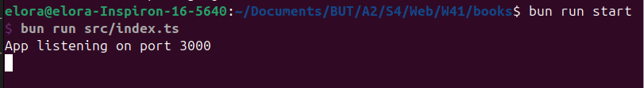

# Mode d'emploi API

L'API se trouve dans le dossier `api` :  

```bash
cd api/
```

Une fois dans le dossier `api` il vous faudra créer votre propre fichier `.env` :  

```bash
cp .env_example .env
```

Il vous faudra ensuite installer les dépendances afin de faire fonctionner l'API :  

```bash
bun install
```

Une fois ces dépendances installées, vous devez générer le schéma Prisma :  

```bash
bunx prisma generate
```

Exécutez ensuite la commande suivante afin de démarrer l'API :  

```bash
bun run start
```

L'API est désormais lancée. Vous devriez voir apparaître les lignes suivantes dans votre terminal :  



> ⚠️ Une fois que vous aurez fini d'utiliser le client web, faites Ctrl+C dans le terminal où vous avez lancé l'API afin de l'éteindre.
